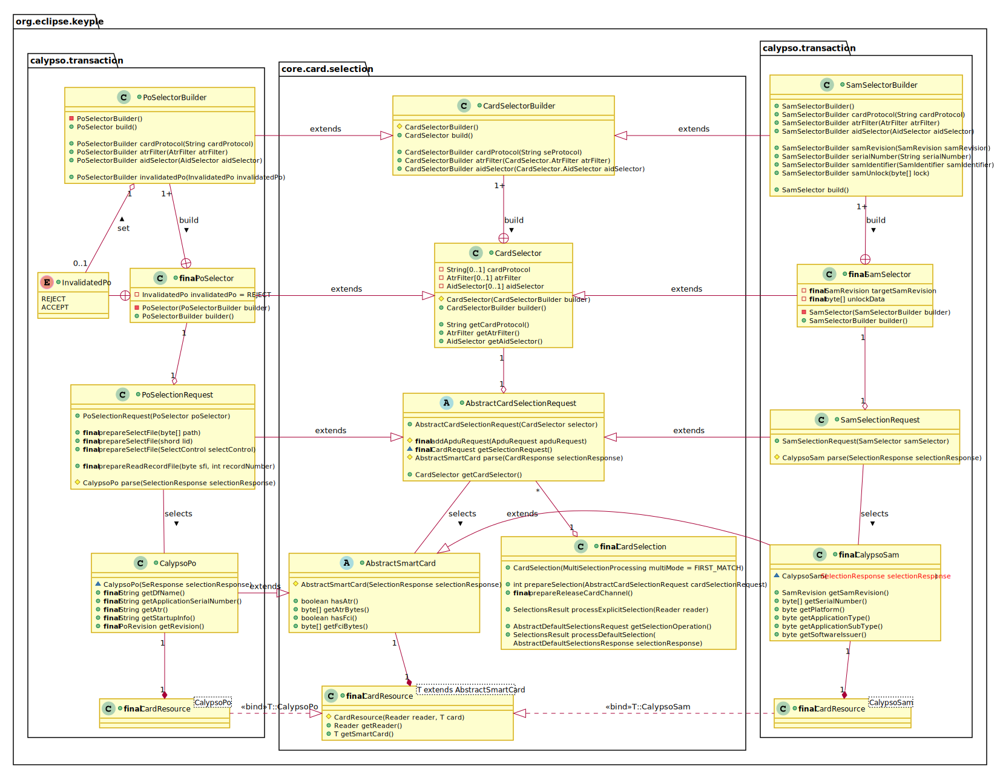
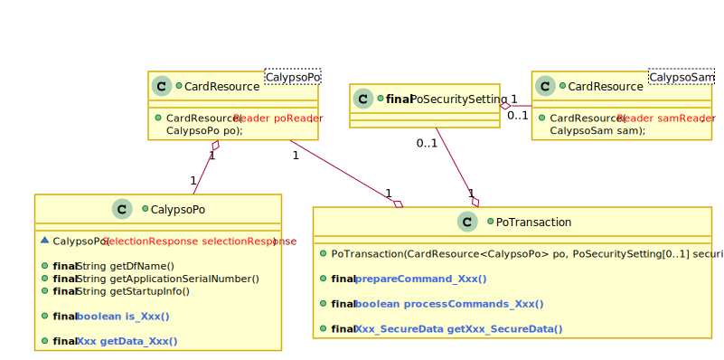
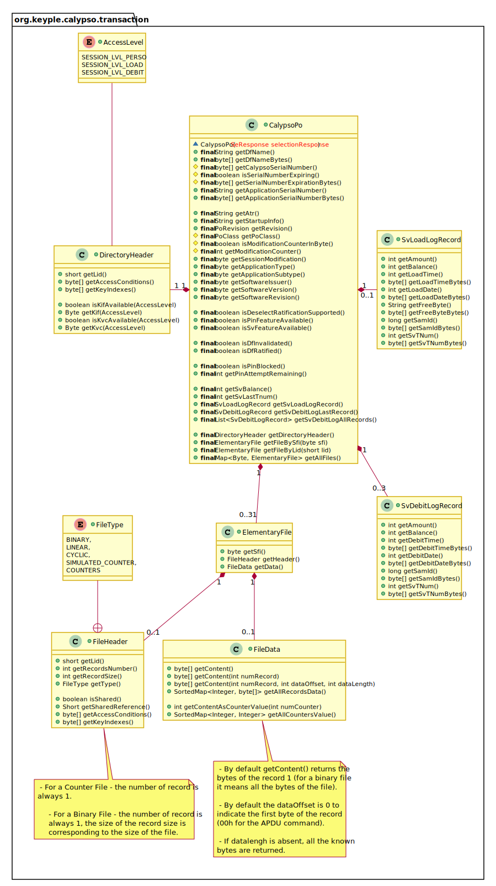
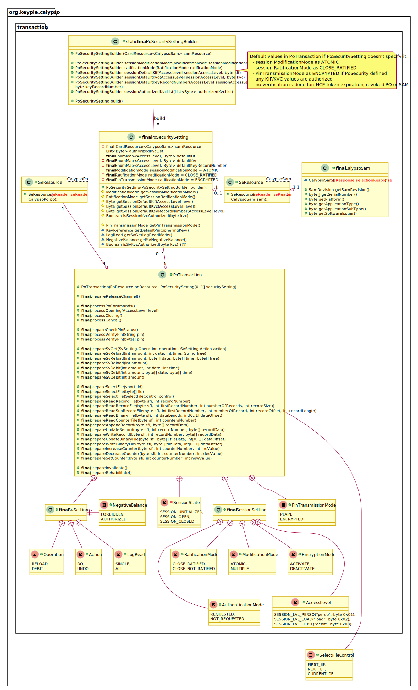

# Keyple Calypso Application API
version 1.0.0

## Calypso Portable Object Selection
Compared to the generic Card Selection API (cf. https://calypsonet.github.io/keyple/KeypleCoreApi/KeypleCore_ApplicationApi.html#card-selection), a PO Selector could be defined to accept only non-invalidated Portable Object (in this cas an invalidated PO isn't selected).

In addition, a PO Selection Request provides methods:

 - to prepare Select File command (useful in particular to manage REV1 Calypso PO for which the select of the targeted DF is required).
 - and to prepare simple read record command (useful to optimize the read of a file present on all targeted PO).

The matching SmartCard resulting from a PO Selection Request is a Calypso PO. In case file records have been read during the selection: the corresponding data could be recovered in the Calypso PO card image.

## Calypso Portable Object Transaction

A Card Resource is a set of a Reader and a **selected** Card application.

 - A Calypso Portable Object is the image of a selected Calypso PO.
 - A Calypso SAM is the image of a selected Calypso SAM.

To operate a Calypso transaction:

 - At least a Calypso Resource (CardResource<CalypsoPo>) is required.
 - A SAM Resource ((CardResource<CalypsoSam>) is required too if security features are involved (Calypso secure session, Stored value transaction, PIN encryption, etc…).

A Calypso PO image provides public ‘getters’ in order to **recover** the information of the selected PO (startup data, file data, … etc).

A transaction with a Calypso PO is fully managed through the PoTransaction object:

 - First a set of PO commands could be defined through ‘**prepare**’ commands.
 - Next the prepared PO commands transmitted when operating a ‘**process**’ command.
 - The responses of the PO are then recovered through the Calypso PO image.

### Calypso card image

### Calypso transaction

Most of the process methods have a ‘Channel Control’ parameter in order to define if the logical with the selected Calypso has to be kept open or to be closed after the processing of the prepared PO commands.
 - processPoCommands is used to transmit a set of prepared PO commands outside of a secure session.
 - processOpening issues an Open Secure Session followed by the prepared PO commands.
 - processPoCommandsInSession allows to transmit a set of prepared PO commands inside of a secure session.
 - processClosing issues first the last prepared PO commands and transmits a Close Secure Session.
 - prepareManageSession allows to change authenticate or change the encryption mode.

## Data model extension

