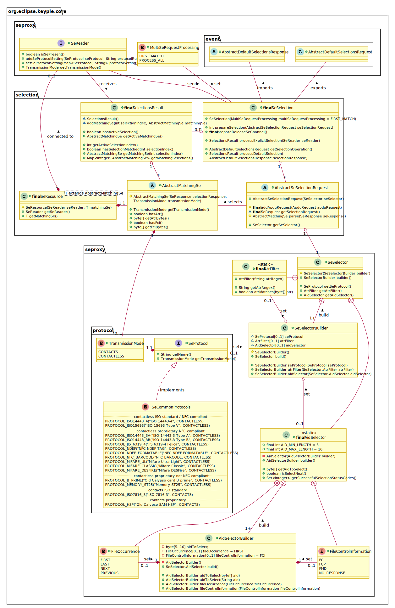

# Keyple Core Application Api - version 0.9 (current 'develop' branch)
## Reader Access
With Keyple, smart card readers are managed through plugins in order to integrate specific reader solutions.
The singleton Secure Element Proxy Service provides the unique name list of registered plugins. There are three kinds of plugin:
 - The ‘Reader Plugin’ is the generic interface to list the readers of a plugin, or to access to a specific reader with its name.
 - The ‘Observable Plugin’ interface extends reader plugins which have the capability to notify registered Plugin Observers about the plug or unplug of readers. Observers could be added or removed to the observable plugin. Useful for systems allowing the hot plug / unplug of readers.
 - A ‘Reader Pool Plugin’ is a plugin for which a reader is available only after an explicit allocation. When not more necessary, a reader has to be released. Useful for server solutions managing farms of readers or interfaced with HSM: unallocated readers or HSM SE instances could be shared between several smart card terminal solutions.

A reader is identified through its unique name in a plugin. There are two kinds of reader:
 - The ‘SE Reader’ is the high-level interface to handle a smart card reader. The presence of SE in a reader could be checked.
 - The ‘Observable Reader’ interface extends SE readers which have the capability to notify registered Reader Observers about the insertion or remove of a Secure Element in the reader. Observers could be added or removed to the observable reader. Useful for systems automatically starting the processing of a SE at its insertion: like a ticketing validator.

(The SE APDU transmission is managed at the low-level plugin API through the ProxyReader interface.)

### Specific Plugin
To hide plugin native implementation classes, the reader plugins are registered to the SE Proxy Service through related specific plugin factory.

### Reader Notifications

#### Plugin event
Several ‘Plugin Observers’ could be registered to an Observable Plugin. In case of reader connection / disconnection, the observable plugin notifies sequentially the registered observers with the corresponding plugin event.
The observable plugin is a blocking API, the thread managing the issuance of the plugin event waits the acknowledge of the observer currently notified.

#### Reader event
Several ‘Reader Observers’ could be registered to an Observable Reader.
An observable reader has the capability to be set with a ‘Default Selections Request’: in this case when a SE is inserted in the reader, the reader will try to operate the configured different default selections. If a selection successfully matches with the SE, instead to simply notify the insertion of SE, the observable reader will notify about a successful selection with a SE application.
 - If the notification mode is defined as ‘always’, then in case of SE insertion, the observable reader will notify a SE matched reader event in case of successful selection, or a simple SE inserted reader event if not.
 - If the notification mode is defined as ‘matched only’, then in case of SE insertion, simple SE inserted reader event aren’t notified.

When the processing of an inserted or matched SE is finished, a reader observer has to notify the observable reader in order to prepare the observable reader to detect the removal of the SE.

Several ‘Reader Observers’ could be registered to an Observable Reader. In case of SE insertion / match / removal, the observable reader notifies sequentially the registered observers with the corresponding reader event. The observable reader could be a blocking API, the thread managing the issuance of the plugin event could wait the acknowledge of the notified observers.

#### Observable reader states
An observable reader is active only if at least one reader observer is registered. When active, an observable read could switch between four internal states: ‘Wait for Start Detection’, ‘Wait for SE Insertion’, ‘Wait for SE Processing’, & ‘Wait for SE Removal’.

The states could be switched:
 - due to an explicit API request (blue arrows), the call of an Observable Reader method:
   - the addition or the remove of an Observable Reader,
   - a request to start or stop the detection,
   - or a notification by a Reader Observer to indicates to the reader that the processing of the SE is finished.
 - Or because of an external event (red arrows), the insertion or the remove of a SE.
   - the insertion a SE causing the observable reader to notify a 'SE matched' reader event (in case of sucessfull default selection) or a 'SE inserted' reader event (Notification Mode defined as always).
   - the removal of a SE causing the observable reader to notify a 'SE removed' reader event.

If a SE detection is started with the 'repeating' polling mode, then later when the SE is removed, the reader starts again to detect a SE.

Whatever the plugin of observable reader, when waiting for the SE removal, any observable reader shall have the capability to notify the remove of the SE.
Some reader plugin solution could have the capability to notify a SE removal also during the processing of the SE.
 

## SE Selection

