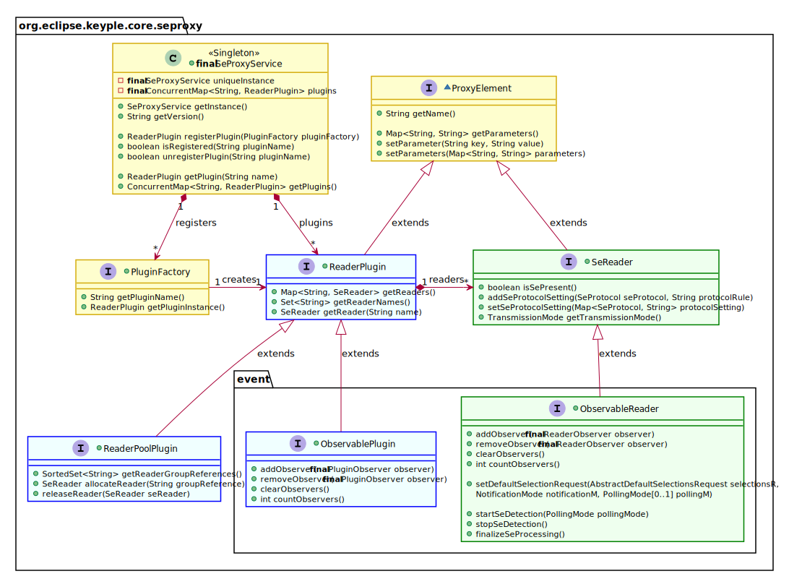
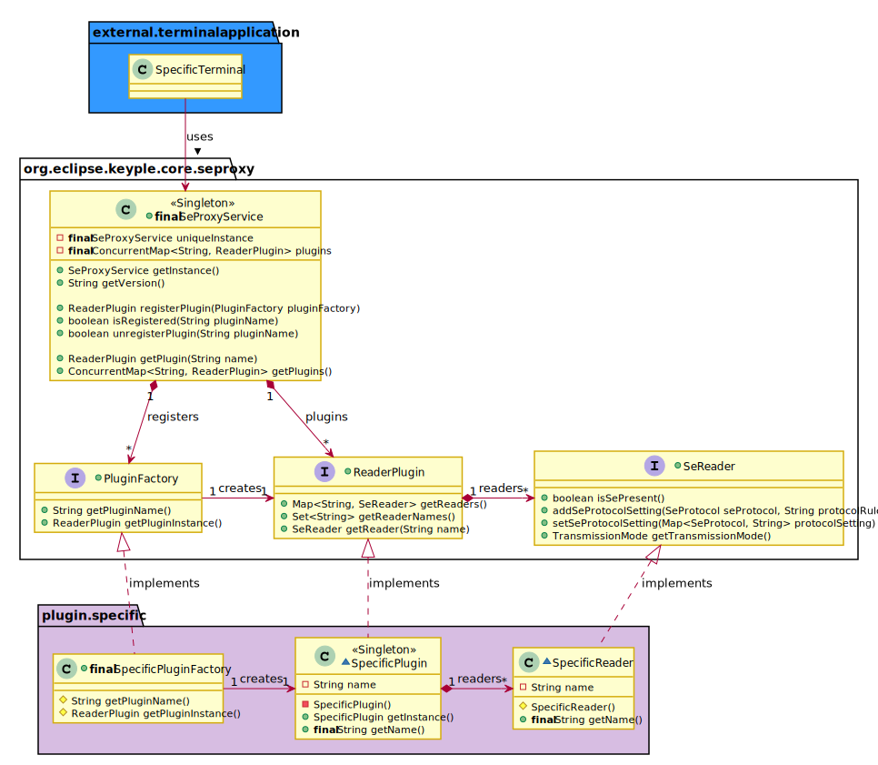

# Keyple Core Application Api - current 'develop'

## Reader Access - v0.9
With Keyple, smart card readers are managed through plugins in order to integrate specific reader solutions.
The singleton Secure Element Proxy Service provides the unique name list of registered plugins. There are three kinds of plugin:

 - The ‘Reader Plugin’ is the generic interface to list the readers of a plugin, or to access to a specific reader with its name.
 - The ‘Observable Plugin’ interface extends reader plugins which have the capability to notify registered Plugin Observers about the plug or unplug of readers. Observers could be added or removed to the observable plugin. Useful for systems allowing the hot plug / unplug of readers.
 - A ‘Reader Pool Plugin’ is a plugin for which a reader is available only after an explicit allocation. When not more necessary, a reader has to be released. Useful for server solutions managing farms of readers or interfaced with HSM: unallocated readers or HSM SE instances could be shared between several smart card terminal solutions.

A reader is identified through its unique name in a plugin. There are two kinds of reader:

 - The ‘SE Reader’ is the high-level interface to handle a smart card reader. The presence of SE in a reader could be checked.
 - The ‘Observable Reader’ interface extends SE readers which have the capability to notify registered Reader Observers about the insertion or remove of a Secure Element in the reader. Observers could be added or removed to the observable reader. Useful for systems automatically starting the processing of a SE at its insertion: like a ticketing validator.
The SE APDU transmission is managed through low-level plugin API (the ProxyReader interface).

## Specific Plugin - v0.9
To hide plugin native implementation classes, the reader plugins are registered to the SE Proxy Service through related specific plugin factory.

## Reader Notifications - v0.9

## SE Selection - v0.9

## Selection Scenarii

