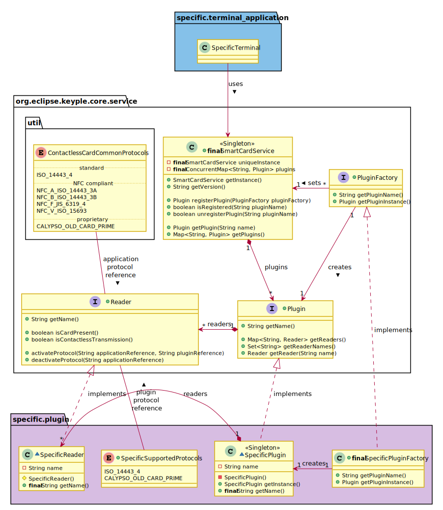

# Keyple Core - 'Service Interface': for the development of ticketing terminal application
version 1.0.0

## Reader Access
On Keyple, the smart card readers are managed through plugins in order to integrate specific reader solutions.
The '**SmartCard Service**' singleton provides the unique name list of registered plugins. There can be three kinds of plugin:
 - The ‘**Plugin**’ is the generic interface to list the readers of a plugin, or to access to a specific reader with its name.
 - The ‘**Observable Plugin**’ interface extends Plugins which have the capability to be observed: in order to notify registered Plugin Observers about the plug or unplug of readers. Plugin Observers could be added or removed to the Observable Plugin. Useful for systems allowing the hot plug / unplug of Readers.
 - A ‘**Pool Plugin**’ is a plugin for which a Reader is available only after an explicit allocation. When not more necessary, a Reader must be released. Useful for server solutions managing farms of Readers or interfaced with HSM: unallocated Readers or HSM instances could be shared between several smartcard terminal solutions.

A smartcard Reader is identified through its unique name in a Plugin. There are two kinds of Reader:
 - The ‘**Reader**’ is the generic interface to handle a smartcard reader. The presence of card in a Reader could be checked.
 - The ‘**Observable Reader**’ interface extends Readers which have the capability to notify registered Reader Observers about the insertion or remove of a Card in the Reader. Reader Observers could be added or removed to the Observable Reader. Useful for systems automatically starting the processing of a Card at its insertion: like a ticketing validator.

(The APDU transmission with a Card is managed at a lower layer, through a Card Solution API.)

### Specific Plugin integration
To hide Plugin native implementation classes, the Plugins are registered to the SmartCard Service through related specific Plugin Factory.

### Reader Notifications
To be notified about '**Plugin Event**' or '**Reader Event**', a terminal application must implement the dedicated '**Plugin Observer**' or '**Reader Observer**' interfaces.

#### Plugin Event
Several ‘Plugin Observers’ could be registered to an Observable Plugin.
In case of reader connection / disconnection, the Observable Plugin notifies sequentially the registered Plugin Observers with the corresponding Plugin Event.
The Observable Plugin is a blocking API, the thread managing the issuance of the Plugin Event waits the acknowledge of the Plugin Observer currently notified.

#### Reader Event
Several ‘Reader Observers’ could be registered to an Observable Reader.
In case of Card insertion / removal or selection match, the Observable Reader notifies sequentially the registered Reader Observers with the corresponding Reader Event. The Observable Reader could be a blocking API, the thread managing the issuance of the Plugin Event could wait the acknowledge of the notified Reader Observers.

An Observable Reader has the capability to be set with a ‘Default Selections Request’: in this case when a Card is inserted in the Reader, the Reader will try to operate the configured default selections. If a selection successfully matches with the Card, instead to simply notify about the insertion of a Card, the Observable Reader will notify about a successful selection with a Card application.
 - If the notification mode is defined as ‘always’, then in case of Card insertion, the Observable Reader will notify a matched card Reader Event in case of successful selection, or a simple card insertion Reader Event if not.
 - If the notification mode is defined as ‘matched only’, then in case of Card insertion, simple card insertion Reader Events are not notified.

When the processing of an inserted or matched Card is finished, a Reader Observer must release the logical channel with the Card, in order to prepare the Observable Reader to detect the removal of the Card.

#### Observable Reader states
An Observable Reader is active only when at least one Reader Observer is registered, and if the start of the detection has been requested. 
When active, an Observable Reader could switch between three internal states: ‘Wait for Card Insertion’, ‘Wait for Card Processing’, & ‘Wait for Card Removal’.

In the nominal case, a Reader Observer indicates to the Observable Reader that the processing of the SE is finished by releasing the Card Channel.
To manage a failure of the Reader Observer process, the Observable Reader interface provides also a method to finalize the Card processing.

The states could be switched:
 - due to an explicit API request (blue arrows):
   - the release of the Card Channel,
   - the call of an Observable Reader method:
     - the addition or the remove of an Observable Reader,
     - a request to start or stop the detection, to finalize the Card processing.
 - Or because of an external event (red arrows), the insertion or the remove of a Card.
   - the insertion a Card causing the Observable Reader to notify a 'Card matched' Reader Event (in case of successful default selection) or a 'Card inserted' Reader Event (Notification Mode defined as always).
   - the removal of a Card causing the Observable Reader to notify a 'Card removed' Reader Event.

If a Card detection is started with the 'repeating' polling mode, then later when the Card is removed, the Reader starts again the detection of a new Card.

Whatever the Plugin of Observable Reader, when waiting for the Card removal, any Observable Reader shall have the capability to notify the remove of the Card.
Some Plugin solutions could have the capability to notify a Card removal also during the processing of the Card.

## Card Selection

### Selection scenarios
Depending on the Card transaction use case, or on the Reader capability, there are two ways to manage the Selection of a Card:
 - Either on a simple Reader, a Selection could be operated directly by transmitting the Selection Request. In this case the same entity manages both the Card Selection and the Card processing.
 - Otherwise, on an Observable Reader, a Default Selection could be defined. In this case the Selection is operated automatically at the insertion of the Card. In this case, the Card Selection is next managed by the Observable Reader, but the Card processing is managed by a Reader Observer.

### Selection setting and processing
A Card Selection request is defined with a Card Selector. A Card Selector could be defined with tree optional levels of selection filter.
 - The selection could be limited to match a specific card communication protocol.
 - The Card ATR could be filtered to match a regular expression.
 - If an AID is defined, the local reader transmits a Select Application APDU command to the card.
If a SE Selector is defined without any filter, the selection is always successful if a card is present in the reader.

Depending on the Keyple Card Solution extension library, a card request could be completed with specific card commands to operate at the selection (for example, a Select File for a specific DF LID, the read of a specific file).

For terminal managing several kinds of card applications, a Card Selection could be prepared with several card selection request to operate sequentially with the card.

According to the defined 'multi selection processing' mode, the card selection could stop at the first selection request matching card application, otherwise all the prepared card selection request could be operated.
 - Before the new processing of card selection request, the logical channel previously opened is closed.
 - The 'channel control' defines if the logical channel should be kept open or close after the last processed card selection request.

The result of a card request selection is a card image of a matching card. For a card selection with multiple requests, several matching card could be provided.
