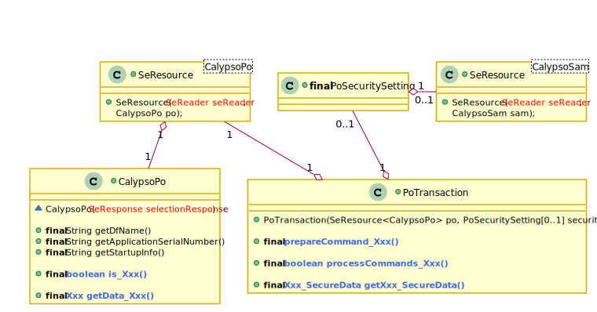
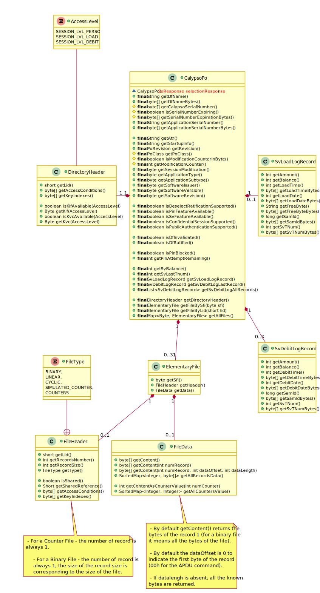
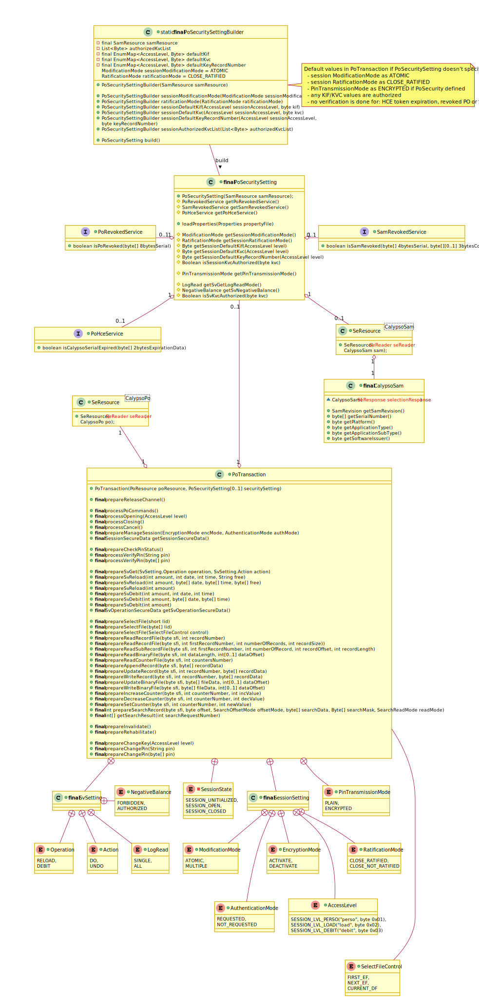

# Calypso Terminal API

## Global Architecture

A Secure Element resource (SeResource) is a set of a smart card reader and a **selected** secure element application.

 - A Calypso Portable Object (CalypsoPo) is the image of a selected Calypso PO.
 - A Calypso SAM (CalypsoSam) is the image of a selected Calypso SAM.

To operate a Calypso transaction:

 - At least a Calypso resource (SeResource<CalypsoPo>) is required.
 - A SAM resource ((SeResource<CalypsoSam>) is required too if security features are involved (Calypso secure session, Stored value transaction, PIN encryption, etc…).

A Calypso PO image provides public ‘getters’ in order to **recover** the information of the selected PO (startup data, file data, … etc).

A transaction with a Calypso PO is fully managed through the PoTransaction object:

 - First a set of PO commands could be defined through ‘**prepare**’ commands.
 - Next the prepared PO commands transmitted when operating a ‘**process**’ command.
 - The responses of the PO are then recovered through the Calypso PO image.

## Calypso card image

## Calypso transaction

Most of the process methods have a ‘Channel Control’ parameter in order to define if the logical with the selected Calypso has to be kept open or to be closed after the processing of the prepared PO commands.
 - processPoCommands is used to transmit a set of prepared PO commands outside of a secure session.
 - processOpening issues an Open Secure Session followed by the prepared PO commands.
 - processPoCommandsInSession allows to transmit a set of prepared PO commands inside of a secure session.
 - processClosing issues first the last prepared PO commands and transmits a Close Secure Session.
 - prepareManageSession allows to change authenticate or change the encryption mode.

