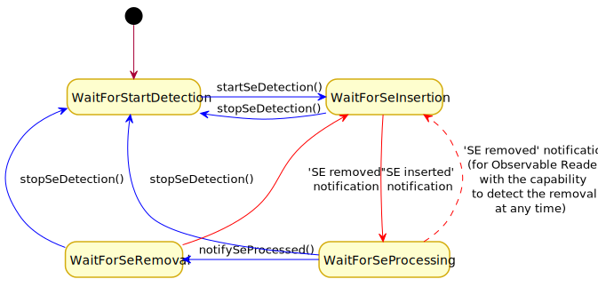

# Secure Element Reader Terminal API

Secure Element reader (SeReader) is a high-level public interface to handle a smart card reader. Its extension proxy reader (ProxyReader) provides the methods:

 - to transmit a SE request (a request of grouped APDU commands) and to receive a SE response (the corresponding grouped APDU responses).
 - or to transmit a list of SE requests and to receive the corresponding list of SE responses.

In case, a SE request is defined with a selector (it could be an AID value to select), the reader opens a logical channel with the present SE and selects the targeted SE application. Then the APDU commands are transmitted.

According to the channel control parameter the logical channel could be kept open or be closed after the SE request transmission.

 - If the channel is kept open, the SE response could then be used to initialize the image of a selected SE (AbstractMatchingSe).
 - If several SE requests are defined for a transmission, in case the selector of a SE request has matched an application in the SE, if the channel is kept open, then the pending SE requests aren’t transmitted to the SE.

Internal states of an Observable Reader:

The states could be switched,
 - due to an explicit API request (blue arrows), the call of an Observable Reader method:
   - a request to start or stop the detection,
   - or a notification to indicates to the reader that the processing of the SE is finished.
 - Or because of an external event (red arrows), the insertion or the remove of a SE:
   - the insertion a SE causing the observable reader to notify a 'SE inserted' reader event,
   - the removal of a SE causing the observable reader to notify a 'SE removed' reader event.
